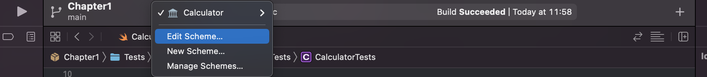
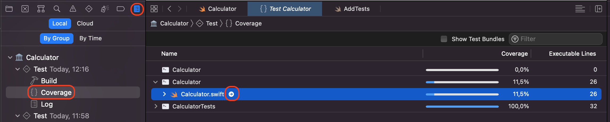
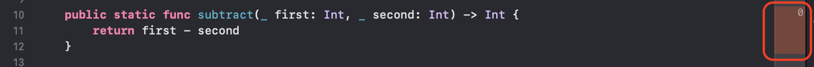

# Chapter 1 - Basics and Pure Functions

## Theory of Testing

Testing is a discipline in Software Development where we make sure that our programs behave as we wanted to.

### Kinds of Testing

A good taxonomy of testing is the [Pyramid of Testing](https://martinfowler.com/articles/practical-test-pyramid.html#TheTestPyramid). The pyramid defines different levels at which we can test our software: the lower the level, the more granular the test is.

1. At the top of the pyramid, we have **UITests**. These tests are explorative tests usually performed by a human. They try to test the software as a user will actually use it. Plus, they try uncommon patterns to see how the software will behave when the user goes wild.
2. In the middle level, we have **Service Tests** or **Integration Tests**. These tests are automated and are meant to test how multiple components behave together. They are usually slower and expensive tests and they use some real components like the staging backend and the staging database.
3. At the lower level, we have the **Unit Tests**. Unit tests are used to test the single components of our code. What is a single component depends on you and how you want to set your testing strategy: in some cases, you consider a `class` as a unit; in some other cases you may consider multiple classes that are strictly related as a unit. In other cases, a single function can be a unit.

In this training, we will mostly focus on unit testing components, in the first four chapters of the Training. In the last chapter, we will also touch **automated UITests** which can be seen as a sort of integration test where we simulate how a user interacts with the application.

### White Box Vs Black Box

When using the [**Black Box**](https://en.wikipedia.org/wiki/Black-box_testing) technique, we treat our component as an opaque box: we provide some inputs and we receive some outputs. We then check that the outputs are correct, given the inputs we gave and the software requirements.

In that context, we don't care about how a piece of software is implemented. We just consider it as a device that spits out some values, given some outputs. The focus of this kind of test is the behaviour of the component.

In [**White box**](https://en.wikipedia.org/wiki/White-box_testing) testing, instead, we know about the internal implementation of a piece of software. When doing white box testing we check that all the paths of the code execution are covered and we verify that the structure of the code works as intended.

There are different philosophies about how a piece of software should be tested. Some think that we only have to do black-box testing so that we can change the internal implementation and we can refactor the code without breaking the tests.

Others think that we should test everything and that it's right that, if we change something in the system, the tests fail. At the end of the day, we do want to have feedback that something has changed.

Whatever philosophy you prefer, in this training, we will explore them both.

## Testing in Practice

We know that testing a piece of software requires us to:

1. provide some inputs.
2. receive some outputs.
3. check that the outputs match what we expect.

That's the basics and what we are going to do over and over.

Although the principle is simple, the practice could be very complicated. We could have implicit inputs and implicit outputs. We could have dependencies that perform operations involving external services. We could have errors as outputs. 

The point is to develop a sort of "library" of patterns we know how to test. You can think about this experience "library" as Lego bricks that you can use to compose your tests: the more example we have seen and practised, the easiest will be to craft a test for the piece of software we are writing.

Let's start to build this library with the simplest component we can test: a [pure function](https://en.wikipedia.org/wiki/Pure_function).

### Pure Functions

A pure function is a function whose output is completely determined by its inputs. It doesn't have any dependency or side effects and every time we provide the same inputs, we get the very same outputs.

A typical example is the sum function:

```swift
func sum(_ first: Int, _ second: Int) -> Int {
	return first + second
} 
```

This function is pure because, given the same inputs, we will always get the same output. Also, it does not perform any side effects and it neither requires any dependencies. 

If we invoke `sum(1, 1)` a thousand times, we get `2` as a result, for a thousand times.

### Code Coverage

When testing a function, we want to be sure that all the execution paths are covered. This means that we want to be sure that the function works correctly for every input we can supply.

Let's consider the following snippet:

```swift
enum ComputationError: Error {
	case divisionByZero
}

func integerDivision(_ first: Int, _ second: Int) throws -> Int {
	guard second != 0 else {
		throw ComputationError.divisionByZero
	}
	return first / second
}
```

The function is pure because its output is completely determined by its inputs and it does not perform side effects.

We can write a test that provides `4` and `2` as inputs and we obtain `2` as output and we can execute it thousands of times getting always the same result.

But is it enough? The answer is no: we don't know how the function works when the second input is `0`.
We need to write a second test to check that. The expected output here is an error.

As a rule of thumb, we have to write at least one test for each code branch. When do we have branches? Every time there is some sort of control-flow statement:

* `if-else`: it requires at least `2` tests.
* `ternary operator`: it requires at least `2` tests.
* `if-else if-...-else`: it requires `n+2` tests, where `n` is the number of `else if` statements.
* `switch`: it requires at least one test for each case
* `guard`: it requires at least two tests, one when the guard stops the execution and one when it doesn't.
* `loops`: we usually need at least three tests: when no loop is executed; when the loop is executed only once; when it is executed multiple times.
* `ranges`: we usually need at least 5 tests. Two for the range boundary, one for a value within the range, one for a value lower than the range, one for a value higher than the range.

Swift is a very peculiar language: it lets us collect various unwrapping statements in a single if or guard. An example is the following:

```swift
func optionalDivision(_ first: Int?, _ second: Int?) throws -> Int? {
	guard 
	  let f = first,
	  let s = second
	else {
		return nil
	}

	guard s != 0 else {
		throw ComputationError.divisionByZero
	}

	return f / s
}

```

How many tests does this function require?

The answer is 4:

1. One test where `first` and `second` are passed correctly and `second` is different from `0`. This is also called the `happy path` because it's the path where everything is correct.
2. One test when the `second` argument is equal to `0`. In this case, we expect the function to `throw` an error.
3. One test where the `first` argument is `nil`, and the second is not. We expect the function to return `nil`. 
4. One test where the `second` argument is `nil` and the first is not. We expect the function to return `nil`.

These tests are the bare minimum. To write these tests, we leveraged the structure of the code, therefore we applied a white-box technique.

A question now: what happens when the first argument is `nil` and the second is `0`? Do we expect `nil` or do we expect an error?

If we look at the structure of the code, we know that we are going to receive a `nil`.
But if we don't know how the code is implemented, we can't know it in advance. This is a very good candidate for a fifth test: in this case, we use black-box testing and we are writing a test to enforce a **software requirement** that someone from the product team provided us.

With this test in place, if someone changes how the code behaves, for example by swapping the unwrapping with the zero check, the tests would start failing.

## Exercises

Welcome to the practical part of the first chapter.

In this section, we prepared an Xcode project with some pure functions. Your task is to write a good test suite for the tests.

The project is a framework called `Calculator`. The project has also a `CalculatorTests` that you can use to add your tests. To open it, simply double click on the `Package.swift` file.

The project starts with a `AddTests.swift` file with a unit test already implemented: you can press `cmd+U` to build and run it and make sure that the test is passing.

### Task 1 - Enable Code coverage

The first thing to do is to enable the code coverage.

Click on the Calculator in the top bar and choose `edit scheme ...`.



Select Test and tick the `Code Coverage` checkbox.


Run the tests once again.

Now, open the **Report Navigator** (`cmd+9`), select the `Coverage` line below the `Test`, and expand the `Calculator` item in the central pane. By hovering over the `Calculator.swift` file, a small arrow should appear. Click on it to be moved to the source file.



The source file will show some red bands on the right:



When the band is red, it means that the line has not been tested. The number, instead, shows how many times the line has been executed by the tests.

One objective of this chapter is to test all the lines of the `Calculator` at least once.

### Task 2 - Complete the AddTests.swift file

Open the `AddTests.swift` file. You can see that one test is already implemented.

The syntax of the test name is the following:

```swift
func test<what>_<when>_<then>()
```

The name of the test is useful to learn what are we testing, under which conditions and what we expect to receive. This helps us understand immediately what the test is about by reading the test name.

Complete the other tests in the file.
Read the test name to understand what to do.

For example:
```swift
func testAdd_whenFirstIsZero_returnsSecond()
```
means that we need to test the `add` function, passing `0` as the first parameter and another value as the second parameter. The expected value is the second parameter.

### Task 3 - Create a test to cover the subtraction function.

1. Create a new file and call it `SubtractionTests`

2. Write tests for the division operation. Try to cover all the possible cases.

### Task 4 - Create a test to cover the multiply function.

1. Create a new file and call it `MultiplyTests`

2. Write tests for the division operation. Try to cover all the possible cases.

### Task 5 - Create a test to cover the division function.

1. Create a new file and call it `DivisionTests`

2. Write tests for the division operation. Try to cover all the possible cases.

### Task 6 - Create a test to cover the average function.

1. Create a new file and call it `AverageTests`

2. Write tests for the division operation. Try to cover all the possible cases.

### Task 7 - Create a test to cover the modulus function.

1. Create a new file and call it `ModulusTests`

2. Write tests for the division operation. Try to cover all the possible cases.
